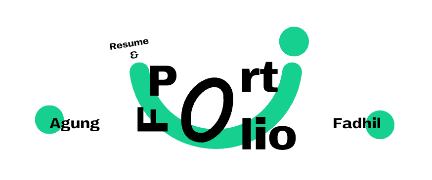

  

###

  
  
  

###

<h1 align="center">
  👋🏻 Hey There! ~
  
</h1>

I’m a code-slinging (as a <strong>Software Engineer</strong>), bug-squashing wizard who turns caffeine into features and chaos into clean commits. As a <strong>Project Manager</strong>, I juggle timelines, egos, and Slack pings like it’s a sport, while running a business keeps me sharp, scrappy, and constantly evolving. I live at the messy, exciting crossroads of creativity and logic—where ideas turn into products and “wait… did we deploy to prod?” is a weekly mantra. Through it all, I stay <strong>Human</strong>: I celebrate small wins, learn from late nights, and never say no to good coffee or great Wi-Fi.

###

<h1 align="center">👨🏻‍💻 My Tech Stacks</h1>

  <!-- Framework -->
  

    
    
    
    
  

  <!-- Library -->
  

    
    
    
    
  

  <!-- Programming Language -->
  

    
    
    
  

  <!-- Database -->
  

    
    
    
    
    
  

  <!-- Utils -->
  

    
    
    
  

  <!-- styling -->
  

    
    
  

  <!-- Apps -->
  

    
    
    
  

  <!-- OS -->
  

    
    
  

###

<h1 align="center">🔥 My Stats</h1>

  <a href="https://git.io/streak-stats">
    <picture>
      <source media="(prefers-color-scheme: dark)" srcset="https://streak-stats.demolab.com?user=agfadhil&theme=vue-dark&border_radius=10" />
      <source media="(prefers-color-scheme: light)" srcset="https://streak-stats.demolab.com?user=agfadhil&theme=vue&border_radius=10" />
      
    </picture>
  </a>

###

<h1 align="center">🪵 My Logs</h1>
<picture>
  <source media="(prefers-color-scheme: dark)" srcset="https://raw.githubusercontent.com/agfadhil/agfadhil/output/pacman-contribution-graph-dark.svg">
  <source media="(prefers-color-scheme: light)" srcset="https://raw.githubusercontent.com/agfadhil/agfadhil/output/pacman-contribution-graph.svg">
  
</picture>

###

<h1 align="center">🍵 Yuhuuuu~</h1>

  
  

